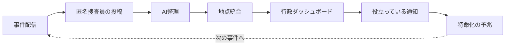
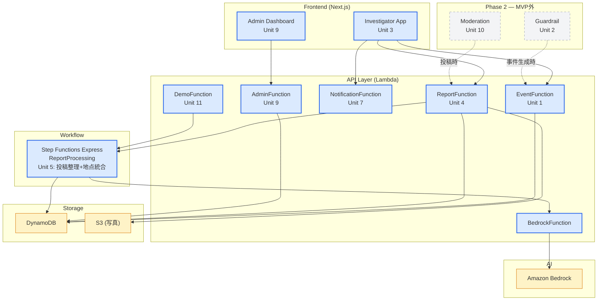

# 町内匿名捜査室 — Anonymous Neighborhood Detectives

> 誰もぶつかっていないのに、みんな少しだけ身構える角がある。
> その違和感の正体を、匿名捜査員として検分してほしい。

> 「人をダメにするサービス」テーマへの応答 — **参加者と行政担当者の両方を、少しだけダメにします**。

AWS Summit Japan 2026 AI-DLC ハッカソン応募作品「町内匿名捜査室」の Inception フェーズ成果物リポジトリです。

現時点ではアプリケーションコードは含まず、AI-DLC の手順に沿って作成した要件、ユーザーストーリー、アプリケーション設計、Unit of Work、実行計画を管理しています。

ハッカソンのお題は **「人をダメにするサービス」** です。本企画は、散歩・観察・昔の記憶・地域への執着を「捜査」に変換し、本人は遊びに熱中しているつもりなのに、その副産物として町の見逃されていた違和感が可視化されていく、という形でこのテーマに応答します。

## Project Overview

町内匿名捜査室は、街の中にある「まだ事件になっていない違和感」を AI が未解決案件のような「事件」として再構成し、市民が匿名捜査員として現地確認・写真投稿・一文報告・推理回答を行うサービスです。

プレイヤーから見える体験は、街歩き謎解きです。裏側では、投稿された観察が AI によって要約・分類・統合され、行政が週次レビューで読める **確認候補地点** として整理されます。

最初の MVP では、1地域・1主人公・1事件に絞り、次の事件を扱います。

> 事件番号 #T-01  
> 誰もぶつかっていないのに、みんな少しだけ身構える角

## Theme Fit: 人をダメにするサービス

このサービスが「人をダメにする」のは、利用者を単に便利にするからではありません。

普通の散歩が現場確認になり、昔の道の記憶が証拠になり、何気ない違和感が事件の手がかりになります。ユーザーは「地域貢献をしてください」と頼まれているのではなく、自分の町に残された小さな未解決案件を追っている感覚で参加します。

この没入が進むと、次のような状態が生まれます。

- 散歩が現場確認になる
- 昔の記憶が証拠になる
- 新着事件を見ずにいられなくなる
- 他の捜査員の報告が気になり、自分の感覚を確かめたくなる
- 自分の勘が「有力な手がかり」として返ってくると、次の事件も追いたくなる

ポイントやランキングで煽るのではなく、**「自分の違和感は間違っていなかった」** という承認が継続動機になります。

表の体験は、あくまで街歩き謎解きです。ユーザーからは行政調査や苦情処理には見えません。一方で裏側では、投稿された観察を AI が要約・分類・地点統合し、行政が週次レビューで確認できる **確認候補地点** に変換します。

ここで生まれる「人をダメにする」構造は、参加者側と行政側の両方にあります。

参加者は、仕事でも義務でもないのに、町の小さな違和感を放っておけなくなります。傍から見れば、日々街中を歩き回り、角や入口や道の見え方を確かめているだけに見える。しかし本人にとっては、それは散歩ではなく現場確認であり、投稿ではなく証拠提出です。没入体験によって、ただの町歩きが「捜査」になってしまう。

行政側もまた、少しだけダメになります。本来であれば職員が現場に出て拾いに行くしかなかった微細な違和感が、匿名捜査員たちの投稿として集まってくる。AI がそれを地点・危険要因・報告件数・時間帯傾向に整理することで、職員はまず席に座ったまま確認候補地点を眺められるようになります。現場に行く仕事がなくなるのではなく、現場に出る前の一次探索が、熱中した参加者と AI に肩代わりされていく。

つまり本サービスは、参加者を「仕事でもないのに町を捜査し続ける人」にし、行政担当者を「まず席に座ったまま町の違和感を受け取れる人」にします。この両側の変化こそが、ハッカソンテーマ **「人をダメにするサービス」** への接続点です。

## Current Status

AI-DLC の Inception フェーズは完了しています。

- Project Type: Greenfield
- Lifecycle Phase: Construction
- Current Stage: Inception complete / Construction ready
- Next Stage: Unit 1 Functional Design

詳細は [aidlc-state.md](aidlc-docs/aidlc-state.md) を参照してください。

## Repository Structure

```text
.
├── README.md
└── aidlc-docs/
    ├── aidlc-state.md
    ├── audit.md
    └── inception/
        ├── requirements/
        ├── user-stories/
        ├── plans/
        └── application-design/
```

## Recommended Reading Order

まず全体像を把握する場合は、次の順で読むのがおすすめです。

1. [AI-DLC State](aidlc-docs/aidlc-state.md)  
   現在の工程状態、完了済みフェーズ、次に実行するステージ。

2. [Requirements](aidlc-docs/inception/requirements/requirements.md)  
   プロダクトビジョン、機能要件、非機能要件、MVPスコープ、技術スタック決定事項。

3. [Personas](aidlc-docs/inception/user-stories/personas.md)  
   匿名捜査員、行政担当者、開発者のペルソナ。

4. [User Stories](aidlc-docs/inception/user-stories/stories.md)  
   13本のユーザーストーリーと受け入れ基準。

5. [Application Design](aidlc-docs/inception/application-design/application-design.md)  
   コンポーネント、API、ワークフロー、データ層の統合設計。

6. [Unit of Work](aidlc-docs/inception/application-design/unit-of-work.md)  
   Construction フェーズで実装する Unit 分解と完了条件。

7. [Execution Plan](aidlc-docs/inception/plans/execution-plan.md)  
   Inception 完了後の Construction 実行計画。

8. [Audit Log](aidlc-docs/audit.md)  
   AI-DLC 実行中の判断、承認、修正履歴。

## Key Design Decisions

Inception フェーズで確定した主な設計判断は以下です。

- MVP は **1地域・1主人公・1事件** に集中する
- Phase 1 は 7 Unit 構成
- Unit 5+6 を統合し、投稿整理 AI と地点統合を同一 Unit で扱う
- Unit 7+8 を統合し、通知生成と進化予兆を同一 Unit で扱う
- 写真付き投稿は `draft -> S3 upload -> finalize` の3ステップ
- Exif 除去はクライアント側 JavaScript で行う
- 行政ダッシュボードは Next.js 固定パスワード + `ADMIN_TOKEN` の2層保護
- デモトリガーは `DEMO_TOKEN` で Admin API と権限を分離する
- Lambda / Bedrock は AWS 実環境、DynamoDB Local はフロントエンド開発・シード確認用
- 特命予兆通知は MVP で実装するが、正式昇格・辞令発行は MVP 外

## Phase 1 Units

Construction Phase 1 では、MVPデモ成立に必要な以下の 7 Unit を実装します。

| Unit | Name | Purpose |
|---|---|---|
| Unit 1 | 事件化エンジン | #T-01 の事件データ提供 |
| Unit 3 | 匿名捜査員向けフロントエンド | 事件一覧、詳細、投稿、通知 |
| Unit 4 | 投稿受付・保存基盤 | Report 保存、S3 upload、finalize |
| Unit 5 | 投稿整理AI + 地点統合 + Workflow | Bedrock要約、危険要因分類、LocationObservation更新 |
| Unit 7 | 役立っている通知 + 進化予兆 | 通知生成、UserProfile評価 |
| Unit 9 | 行政ダッシュボード | 確認候補地点一覧、詳細、レビュー更新 |
| Unit 11 | デモ用即時処理トリガー | 15分デモ用の同期処理とシードデータ |

依存関係は [Unit Dependency](aidlc-docs/inception/application-design/unit-of-work-dependency.md) を参照してください。

## MVP Demo Goal

15分以内のデモで、以下のループを見せることを目標にします。



## デモシナリオ概要(15分想定)

| Scene | 内容 |
|-------|------|
| 0. 導入 | サービスのピッチと主人公(佐藤さん 68歳)を紹介 |
| 1. 事件配信 | 朝の散歩前、事件 #T-01 が届く |
| 2. 現場確認 | 「半歩遅れて見える」感覚に気づく。同地点の他捜査員報告も表示 |
| 3. 投稿 | 写真+一文+選択式回答(3タップ) |
| 4. AI整理 | 投稿が要約・分類される |
| 5. 行政ダッシュボード反映 | 「即応候補」として地点表示 |
| 6. 通知 | 「あなたの報告は有力な手がかりとして整理されました」 |
| 7. 締め | 表は遊び、裏は確認候補地点化 — 両側を少しダメにする構造 |

詳細は [mvp-demo-scenario.md](aidlc-docs/inception/plans/) または `aidlc-docs/inception/` 配下の関連ドキュメントを参照してください。

## Technology Direction

想定技術スタックは以下です。

- Frontend: Next.js / React / TypeScript
- API: Amazon API Gateway + AWS Lambda
- Workflow: AWS Step Functions Express Workflow
- AI: Amazon Bedrock
- Data: Amazon DynamoDB + Amazon S3
- Monitoring: Amazon CloudWatch
- Deploy: AWS Amplify
- Infrastructure: AWS SAM prototype -> AWS CDK TypeScript migration

### コンポーネント全体図

Phase 1 (MVP) の Unit を青色で、Phase 2(MVP 外)を点線で示します。



Construction 開始前に、利用可能な Bedrock モデルとリージョンを確認します。

## Notes

- 本リポジトリは Inception フェーズの成果物を統合した提出物リポジトリです。
- Inception フェーズは完了しており、Construction フェーズ(Unit 1 の Functional Design から)へ移行中です。
- `aidlc-docs/` 配下は AI-DLC ワークフローに沿った工程成果物として管理しています。
